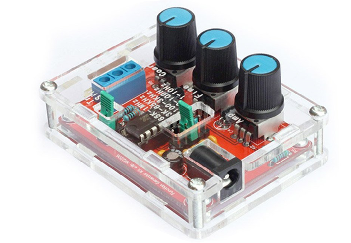
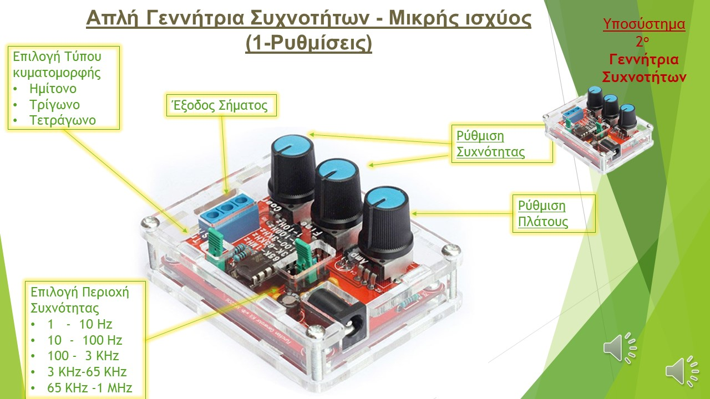
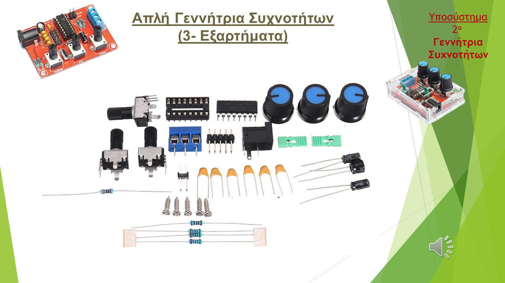
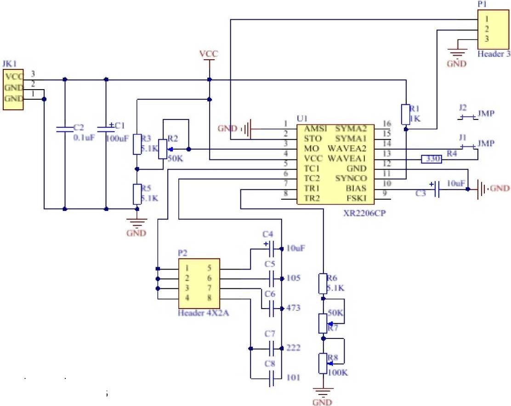
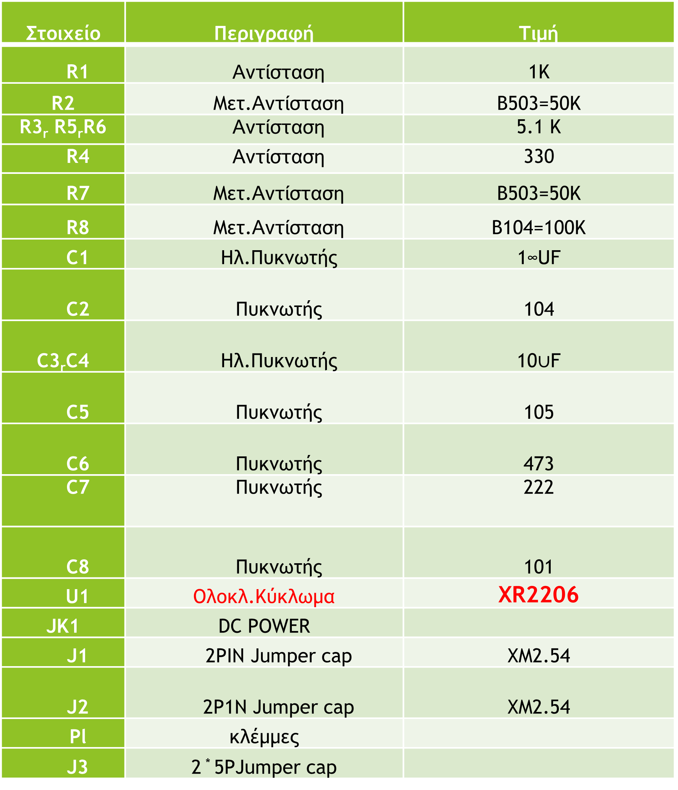
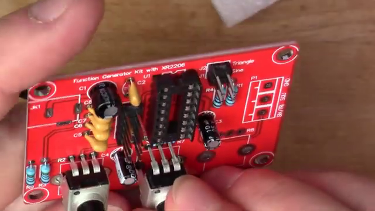

# Απλή Γεννήτρια Συχνοτήτων - Μικρής ισχύος

Στην ενότητα αυτή θα περιγράψουμε,tο δεύτερο υποσύστημα  πού υλοποιήσαμε , που είναι μία Απλή Γεννήτρια Συχνοτήτων , μικρής ισχύος και κατανάλωσης ενέργειας.  

Χωρίς βέβαια να φθάσουμε στις προδιαγραφές των εμπορικών γεννητριών , παρακάτω παρουσιάζεται η κατασκευή μας. Πιο συγκεκριμένα, μπορούμε να έχουμε έξοδο **ημιτονικής** , **τριγωνικής** και **τετραγωνικής** κυματομορφής. Μέσω ενός τζάμπερ μπορούμε επιλέγουμε την περιοχή συχνοτήτων που θέλουμε στην έξοδο και η οποία φτάνει μέχρι και το **1 megaHertz**. Τέλος μέσω των ποτενσιόμετρων  μπορούμε να έχουμε μικρόρυθμίσεις στο πλάτος και τη συχνότητα.

 Προτού την παρουσίαση της κατασκευής θα θέλαμε να αναφερθούμε στους λόγους που μας έκαναν να το υλοποιήσουμε για να δείξουμε ποια ανάγκη καλύπτει και ποιοι ήταν οι στόχοι μας.

Πιο συγκεκριμένα οι στόχοι του συστήματος αυτού είναι η παρακάτω:

* Εξοικείωση με τον ηλεκτρονικό σχεδιασμό
* Γνωριμία με απλά ηλεκτρονικά εξαρτήματα
* Γνωριμία και χρήση προγραμμάτων Ανοικτού κώδικα για την παραγωγή PCB
* Απόκτηση πρακτικών δεξιοτήτων στη συναρμολόγηση ηλεκτρονικών

Ειδικότερα ,σκοπός της κατασκευής ήταν να αποκτήσει το εργαστήριό μία γεννήτρια συχνοτήτων που είναι ένα χρήσιμο εργαλείο για την εκπαιδευτική διαδικασία, Εξοικονομώντας ταυτόχρονα ενέργεια και χρηματικούς πόρους.Ειδικότεροι Σκοποί του Υποσυστήματος ήταν:
* Πρόταση για πολλά Σχολικά Εργαστήρια , που δεν έχουν Γεννήτρια Συχνοτήτων (ή Αντικατάσταση αντίστοιχων ενεργοβόρων συσκευών)
* Κατασκευή απλής Γεννήτριας (ελάχιστης ενέργειας) για χρήση στο εργαστήριο
* Εξοικονόμηση Ενέργειας και χρημάτων

	
Η κατασκευή μας όπως φαίνεται και από τις εικόνες είναι πολύ απλή και χρειάζεται ελάχιστα ηλεκτρονικά εξαρτήματα

Βασικά στηρίζεται  ένα πολύ απλό ολοκληρωμένο το **XR2206** . Επίσης χρησιμοποιεί κάποιες μεταβλητές αντιστάσεις ποτενσιόμετρα για να επιτύχει της απαραίτητες ρυθμίσεις

Το pcb της υλοποίησης είναι απλό και έχει όλα τα ηλεκτρονικά στοιχεία στη μία πλευρά ενώ η δεύτερη πλευρά του είναι μόνο για τις κολλήσεις.Δώσαμε ιδιαίτερη προσοχή στα στοιχεία με **αρίθμηση** όπως τα ολοκληρωμένα  καθώς και σε αυτά που έχουν **πολικότητα** όπως οι ηλεκτρολυτικοί πυκνωτές.

Αναλυτικότερα χρησιμοποιήθηκαν :

- το ολοκληρωμένο  XR2206 
- Αντιστάσεις  R
- Ηλεκτρολυτικοί Πυκνωτές C
- Ποτενσιόμετρα Rp
- Βίδες για  στήριξη
- Καλώδια για συνδέσεις

Προτού ξεκινήσει το στάδιο της κατασκευής,  αναζητήσαμε και βρήκαμε οδηγίες για  για το πώς γίνονται σωστά οι κολλήσεις ηλεκτρονικών εξαρτημάτων στις πλακέτες. Επίσης έγινε παρουσίαση για τους κανόνες ασφαλείας που πρέπει να ακολουθούνται κατά τη διαδικασία της συγκόλλησης.
Στο επόμενο στάδιο συναρμολογήσαμε  το σύστημα.

Και τελικά ......πειράματα και έλεγχος

---

