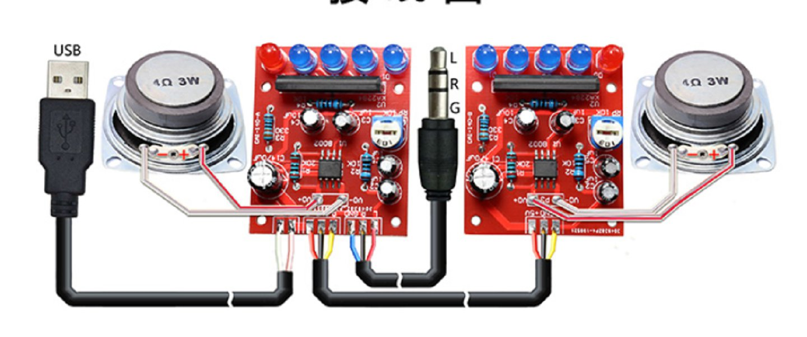
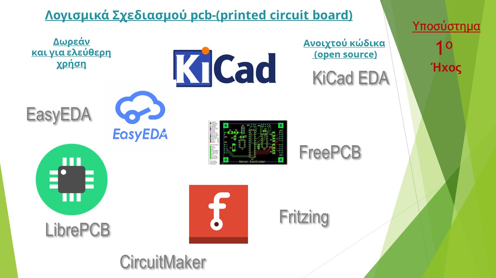

# Απλός ενισχυτής ήχου μικρής ισχύος, με Φωτεινή ένδειξη έντασης και ρύθμιση ευαισθησίας

Στην ενότητα αυτή θα περιγράψουμε, ένα κομμάτι από το φετινό μας έργο που έχει θέμα την εξοικονόμηση ενέργειας στα εργαστήρια του σχολείου μας. 
Eίναι  το πρώτο υποσύστημα που αναφέρεται στη συσκευή ήχου πού υλοποιήσαμε.
 
Πιο συγκεκριμένα είναι ένας απλός ενισχυτής ήχου, μικρής ισχύος και κατανάλωσης ενέργειας με μία φωτεινή ένδειξη έντασης του ήχου.  

 Προτού την παρουσίαση της κατασκευής θα θέλαμε να αναφερθούμε στους λόγους που μας έκαναν να το υλοποιήσουμε για να δείξουμε ποια ανάγκη καλύπτει και ποιοι ήταν οι στόχοι μας.

Πιο συγκεκριμένα οι στόχοι του συστήματος αυτού είναι η παρακάτω:

 - Εξοικείωση με τον **ηλεκτρονικό σχεδιασμό**
- Γνωριμία με τα απλά ηλεκτρονικά εξαρτήματα όπως  ολοκληρωμένα κυκλώματα,ηλεκτρολυτικοί πυκνωτές , κ.τ.λ
- Γνωριμία και χρήση προγραμμάτων **Ανοικτού κώδικα** για την παραγωγή **PCB** 
- Απόκτηση πρακτικών δεξιοτήτων στη **συναρμολόγηση** και **επιδιόρθωση** ηλεκτρονικών πλακετών....
- **Επαναχρησιμοποίηση** παλιών εξαρτημάτων , όπως ηχεία ενισχυτές , κ.τ.λ
- Κατασκευή ηχητικού συστήματος **ελάχιστης ενέργειας**
- **Αντικατάσταση** αντίστοιχων ενεργοβόρων συσκευών
- Ενσωμάτωση στο σύστημα **αναγνώρισης ομιλίας** που αναπτύξαμε
  
	---

	---

Καταρχάς, μέσα από την υλοποίηση του υποσυστήματος επιτεύχθηκε ο πρώτος στόχος ο οποίος ήταν η γνωριμία με το ηλεκτρονικό σχεδιασμό.  

Πιο συγκεκριμένα γνωρίσαμε συστήματα **CAD** που χρησιμοποιούνται στη Μοντέρνα βιομηχανία. 
Κατανοήσαμε ότι ένα σύστημα CAD δηλαδή **computer aided design**  μας βοηθάει σε όλα τα στάδια της σχεδίασης και της παραγωγής παραγωγής  στον σύγχρονο κόσμο.

Εξειδικεύοντας στην σχεδίαση ηλεκτρονικών Συστημάτων στο λεγόμενο συστήματα **eda**  δηλαδή **electronic design automation**,  μας βοηθούν σε όλα τα στάδια της παραγωγής και σε όλο το φάσμα προϊόντων από την κατασκευή ολοκληρωμένων κυκλωμάτων έως και την παραγωγή pcb  δηλαδή τυπωμένων κυκλωμάτων. 

Μέσα από την έρευνά μας γνωρίσαμε και εστιάσαμε στα λογισμικά ανοιχτού κώδικα και ελεύθερης χρήσης. Επίσης ανακαλύψαμε  ότι πολλοί χρήστες έχουν διαμοιραστεί  μεγάλο πλήθος ηλεκτρονικών σχεδιάσεων  και κυκλωμάτων  τα οποία κάθε χρήστης μπορεί ελεύθερα να επαναχρησιμοποίησει. 

Πέρα από τη θεωρητική γνώση ,  σε πρακτικό επίπεδο  αυτό που θέλουμε να γνωρίσουμε  περισσότερο ήταν οι πλακέτες τυπωμένων κυκλωμάτων που όλοι ξέρουμε ότι αποτελούν την βάση για όλες τις ηλεκτρονικές συσκευές που χρησιμοποιούμε.

Μέσα από την ενασχόλησή μας με το έργο, κατανοήσουμε τι είναι οι πλακέτες τυπωμένων κυκλωμάτων, πώς σχεδιάζονται και πως χρησιμοποιούνται.

---

Στον ενισχυτή   χρησιμοποιείτε ένα πολύ ένα πολύ απλό ολοκληρωμένο κύκλωμα το  **8002Α**  που είναι υπεύθυνο για την **ενίσχυση του ήχου**.
Επίσης το ολοκληρωμένο **ΚΑ2284**  το οποίο αναλαμβάνει την **οδήγηση των  φωτεινών  Led ** παρακολουθώντας την ένταση του ήχου.
   

 

Το pcb της υλοποίησης είναι απλό και έχει όλα τα ηλεκτρονικά στοιχεία στη μία πλευρά ενώ η δεύτερη πλευρά του είναι μόνο για τις κολλήσεις.
Δώσαμε ιδιαίτερη προσοχή στα στοιχεία με **αρίθμηση** όπως τα ολοκληρωμένα  καθώς και σε αυτά που έχουν **πολικότητα** όπως οι ηλεκτρολυτικοί πυκνωτές και τα led.

Τέλος, Εκτός από τα παραπάνω εξαρτήματα όπως φαίνεται και στη λίστα χρησιμοποιήσαμε αρκετούς αρκετές αντιστάσεις ένα ΠΟΤΕΝΣΙΌΜΕΤΡΟ  που χρειάζεται για τη ρύθμιση της ευαισθησίας στην παρακολούθηση της έντασης καθώς και αρκετά καλώδια για συνδέσεις και βίδες για τη στήριξη.
Αναλυτικότερα χρησιμοποιήθηκαν :

- Αντιστάσεις  R
- Ολοκληρωμένα Κυκλώματα  IC
- Ηλεκτρολυτικοί Πυκνωτές C
- Ποτενσιόμετρα Rp
- Βίδες για  στήριξη
- Καλώδια για συνδέσεις
- Ηχεία

....

  
---

Προτού ξεκινήσει το στάδιο της κατασκευής,  αναζητήσαμε και βρήκαμε οδηγίες για  για το πώς γίνονται σωστά οι κολλήσεις ηλεκτρονικών εξαρτημάτων στις πλακέτες. 

Επίσης έγινε παρουσίαση για τους κανόνες ασφαλείας που πρέπει να ακολουθούνται κατά τη διαδικασία της συγκόλλησης.

Μάθαμε και κάναμε πρακτική εξάσκηση στο πώς συγκολλούνται πρώτα τα εύκολα διαμπερή εξαρτήματα  through hole .

Σε επόμενο στάδιο  εξασκηθεί κάμε στην πιο δύσκολη διαδικασία της συγκόλλησης ολοκληρωμένων SMT  δηλαδή επιφανειακής τοποθέτησης.
Στο επόμενο στάδιο συναρμολογήσαμε  το σύστημα.

